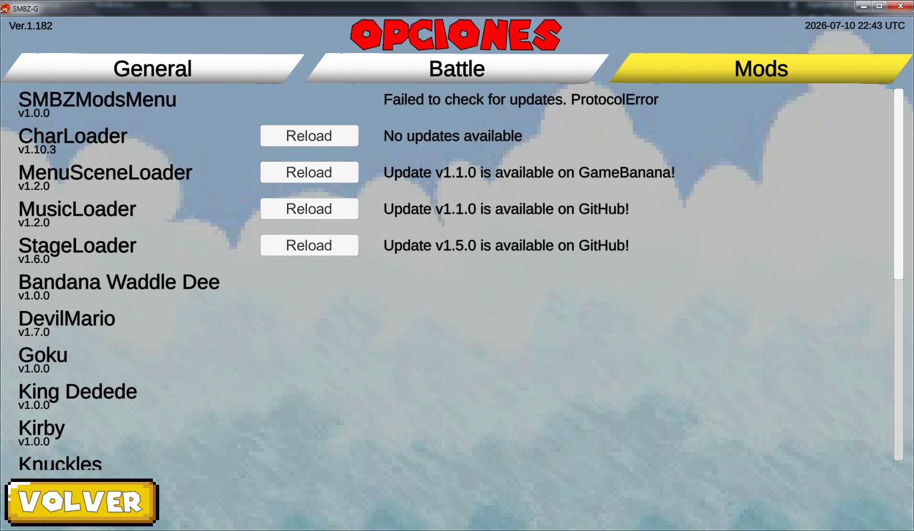

# SMBZModsMenu
A mod for SMBZ-G which adds a 'mods' menu tab in the Settings menu, allowing you to see all loaded DLL mods.

Other mods can inject themselves into this list of mods and provide additional functionality such as:
* Reloading the mod's assets (such as custom stages from StageLoader, custom characters from CharLoader, etc...)
* Checking for available updates on GitHub or GameBanana

To install, go to [Releases](http://github.com/headshot2017/smbzg-modsmenu/releases), extract to the root of SMBZ-G folder, where the .exe is



This mod also has the ability to load mods in a specific order before vanilla game assets/events:
* Load mods before the character skin database is loaded
* Load mods before entering the main menu

## How to use this in my mod?
* Open your mod's project/solution in Visual Studio Community (NOT Visual Studio Code)
* In the solution explorer, right click 'Dependencies' and click 'Add assembly reference'
* Click 'Browse' and find 'SMBZModsMenu.dll' in the SMBZ-G Mods folder
* Click OK
* Go to Core.cs

Pick one or multiple of the following and add it to the `public override void OnLateInitializeMelon()` function.

### Adding a mod entry
```cs
public class Core : MelonMod
{
    public override void OnLateInitializeMelon()
    {
        SMBZModsMenu.Core.ModEntries.Add(new()
        {
            // MelonLoader info about the mod
            info = Info,

            // Function to call when the Reload button for
            // this mod is clicked. This field is not required
            // and can be left out.
            // Not needed for custom characters made with CharLoader.
            reloadFunction = LoadModAssets,

            // For update-checking, where to look for updates?
            // SMBZModsMenu.ModUpdateLocation.GitHub
            // SMBZModsMenu.ModUpdateLocation.Gamebanana_Name
            // SMBZModsMenu.ModUpdateLocation.Gamebanana_ID
            updateLocation = SMBZModsMenu.ModUpdateLocation.Gamebanana_Name,

            // String that specifies the repository where to look for updates.
            // if updateLocation is GitHub: "username/repository", e.g. "headshot2017/smbzg-modsmenu"
            // if updateLocation is Gamebanana_Name: The exact name of the submission in GameBanana.
            // if updateLocation is Gamebanana_ID: The ID of the submission in GameBanana. This ID is a number at the end of the address bar, e.g. gamebanana.com/mods/388538
            updateRepo = "SMBZModsMenu"


            // IMPORTANT NOTE: If you add update-checking functionality, please make sure to
            // increase the version in [assembly: MelonInfo] in Core.cs when releasing
            // an update. On a new project this is "1.0.0"
        });

        // Load
        LoadModAssets();
    }

    void LoadModAssets()
    {
        // Load your mod's assets here by
        // creating a GameObject with a LoaderComponent
        // and mark it with DontDestroyOnLoad()
        // (See CharLoader, StageLoader, MusicLoader or MenuSceneLoader code for reference)

        // If your mod is a custom character mod for CharLoader,
        // you don't need this. CharLoader will reload your character's
        // assets for you when clicking CharLoader's Reload button in
        // the Mods settings tab.

        // Reloading custom code this way is not supported. You
        // will have to restart the game.
    }
}
```

### Loading the mod before character skins or main menu
```cs
public class Core : MelonMod
{
    // Boolean to track when mod is loaded
    // Should be set to true in a MonoBehaviour component
    // that is in charge of loading the mod assets or resources.
    // If you need reference, see LoaderComponent.cs in my loader mods like CharLoader or MenuSceneLoader.
    public static bool ModLoaded;

    public override void OnLateInitializeMelon()
    {
        // If you want the mod to load before the game loads character skins:
        SMBZModsMenu.Core.BeforeSkins.Add(() => ModLoaded);

        // If you want the mod to load before the game enters the main menu:
        SMBZModsMenu.Core.BeforeMainMenu.Add(() => ModLoaded);
    }
}
```